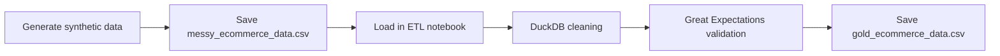

# Day 02 Project: Data Generation and ETL Validation

This folder contains a small end-to-end data pipeline built in Jupyter notebooks. It starts by generating synthetic e-commerce data, then cleans and validates that data with DuckDB and Great Expectations.

## Project Goal

The goal of this project is to demonstrate a simple data engineering workflow:

1. Generate raw data.
2. Load it into a notebook.
3. Clean it with SQL-style logic.
4. Validate the final dataset with data quality checks.
5. Save a gold version of the cleaned data.

## Folder Contents

- `01_generate_data.ipynb` - creates synthetic messy e-commerce data and exports it to CSV.
- `02_etl_pipeline.ipynb` - extracts the generated data, transforms it, validates it, and saves the final gold dataset.

## Notebook 1: Data Generation

`01_generate_data.ipynb` builds a sample dataset with 100 rows. The data includes:

- `transaction_id`
- `customer_age`
- `purchase_amount`
- `status`

The notebook intentionally creates messy records so the pipeline has something realistic to clean:

- missing values in `customer_age`
- underage values such as 17
- unrealistic ages such as 120
- negative purchase amounts
- invalid status values such as `UNKNOWN`

The notebook writes the generated file as `messy_ecommerce_data.csv` in the notebook runtime directory.

## Notebook 2: ETL Pipeline

`02_etl_pipeline.ipynb` processes the raw data in three main stages.

### 1. Extract

The notebook reads `messy_ecommerce_data.csv` from the current notebook working directory.

### 2. Transform

DuckDB SQL is used to clean the data by:

- casting `customer_age` to integer
- rounding `purchase_amount`
- keeping only valid status values
- filtering out null ages
- filtering out non-positive purchase amounts

The result is stored in `clean_data`.

### 3. Validate

Great Expectations 1.17.2 is used to enforce data quality checks. The validation logic checks that:

- `transaction_id` is not null
- `customer_age` is between 18 and 99
- `status` is one of `completed`, `pending`, or `failed`

The notebook validates a filtered subset called `validated_data`, which contains only rows that satisfy the business rules.

If validation passes, the notebook saves `gold_ecommerce_data.csv`.

## Output Files

The notebooks generate these CSV files during execution:

- `messy_ecommerce_data.csv` - raw synthetic input data
- `gold_ecommerce_data.csv` - validated, cleaned output data

These files are written to the notebook runtime directory.

## Dependencies

The pipeline uses:

- `pandas`
- `numpy`
- `duckdb`
- `great_expectations`

## How to Run

Run the notebooks in order:

1. Open `01_generate_data.ipynb` and run all cells.
2. Open `02_etl_pipeline.ipynb` and run all cells.

If you are running in a notebook environment where the working directory is not your local folder, the CSV files may appear under the kernel runtime path instead of the workspace folder.

## Pipeline Summary

The overall flow is:

## Notes

- The raw dataset is intentionally imperfect.
- Validation is strict by design.
- The gold dataset is the output you would use for downstream analytics or model training.
